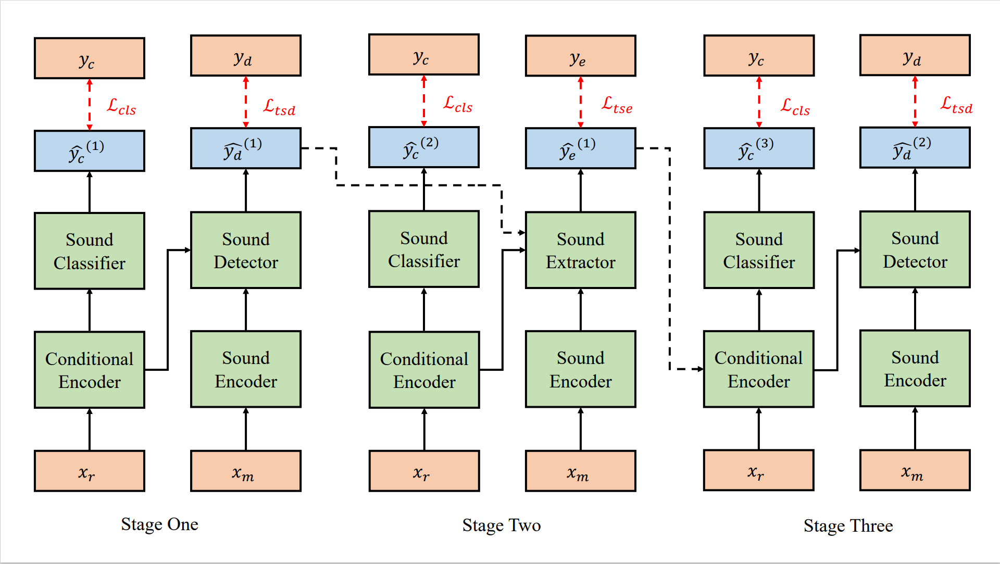

# Tim-TSENet
The source code  of our paper "Improving Target Sound Extraction with Timestamp Information" (Tim-TSENet).  
In this paper, we propose to use target sound detection network (TSDNet) to help target sound extractor (TSENet). Furthermore, we find that TSENet also can help TSDNet, so that a mutual learning framework is proposed. The framework as following shows. 

  

#### Dataset
You can directly download our dataset from Baidu desk. 链接：https://pan.baidu.com/s/1lkwOANzZIet6LqKdrxGNtg 
提取码：qn0y 
 
You can also generate dataset according to our scripts.  
If you plan to generate samples by yourself, please first download FSD dataset https://annotator.freesound.org/fsd/ and DCASE2019 TASK1A dataset. https://dcase.community/challenge2019/task-acoustic-scene-classification  
Secondly, please set the true path, and run generate_data_fsd_kaggle2.py and create_scp.py.

#### TSE model
Folder TSENET includes the code of our baseline model (TSENet), which is based ConvTasNet. you can run it by 
bash start.sh   Furthermore, you can set different parameter on config file.

#### TSD model
Folder TSDNET includes the code of TSD, which is used to detect the target sound.

#### Tim-TSENet
Combining TSENet and TSDNet, we can finish our Tim-TSENet.

#### Future work
We will re-orgnize our Tim-TSENet code to be a unify framework. Our current version is separated.

#### Citation
If our code can give you some help, please cite our papar and stars our code.
@article{wang2022improving,
  title={Improving Target Sound Extraction with Timestamp Information},
  author={Wang, Helin and Yang, Dongchao and Weng, Chao and Yu, Jianwei and Zou, Yuexian},
  journal={arXiv preprint arXiv:2204.00821},
  year={2022}
}